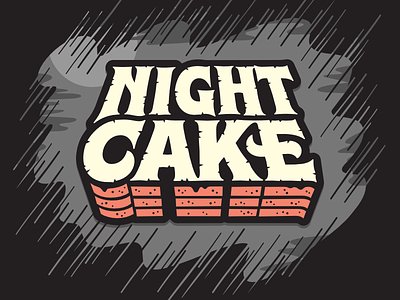

# Nightcake

A Node.js Authentication Microservice

## About this project

This project is a lightweight authentication microservice. It mainly implements two functionalities:

1. A sign up route responsible for storing an email-password pair into a MySQL database.
1. A log in route responsible for retrieving an email-password pair from the database, and generating an access token.

### Layers

- The Router Layer
- The Service Layer
- The Data Access Layer

## Features

...coming soon

## Running Locally

...coming soon
